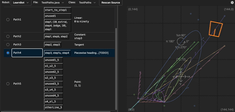

# A PedroPath visualizer



## How to use this thing:

0. Have a default web browser installed
1. Install the [Bun](https://bun.com) Javascript runtime.
2. Either:
   1. Navigate to the root of your robot source code directory from a command
      line
      - Windows: use Windows Terminal or the Command Host, and PowerShell or
        Command Prompt.
      - MacOS: use Terminal or iTerm (or WezTerm, or whatever terminal emulator
        and shell you want).
      - Linux: Use your favorite terminal emulator and shell. If you're using
        Linux, you don't need my help.
      - use `cd <folder location>` to get to where you put your source code.
   2. Type `bunx @freik/pedroviz`.
3. Or:
   1. Open up a command line
   2. type `bunx @freik/pedroviz <location of your source repository>`
4. Advanced folks (who might use Bun for other things as well):
   1. Add it to your `package.json` dependency list: `bun add @freik/pedroviz`
   2. Make a script to call `pedroviz`. If the `package.json` file isn't in your
      source repo root, add the location of your source as the second command.

The first time you use the app, it will take some time to download & install the
package. Once it's been installed, you no longer need to be connected to the
interwebs to use the visualizer. So you can be connected to your _robot_ :D

You'll see something like this:

```text
Parsing code: Please wait...
Found directory /home/freik/src/ftc/BioBuzz2026
🚀 Server running at http://localhost:3000/
```

And then a browser window should open up. If it comes up with a 404, just
refresh the window. Depending on how fast your computer is, it can take a few
seconds. Once the application is visible:

1. Select your robot (if you have multiple TeamCode-like directories), source
   file (if you have multiple files that contain PedroPath Poses, Beziers, and
   PathChains), and the specific Java Class (if you have multiple nested classes
   in a single `.java` source file). If you only have one file with all your
   paths-n-stuff in it, it will be automatically selected for you.
2. Expand the Values, Poses, Curves, and PathChains section to see the data.
3. Select a PathChain to see a robot follow the path.

# Goals / What is this? / Why not just use the [PedroPath Visualizer](https://visualizer.pedropathing.com)?

The **goal** is for this to be a _local_ application that let's you vizualize
and edit PedroPath's. The _reasons_ for this as opposed to just using
[visualizer.pedropathing.com](https://visualizer.pedropathing.com/) are twofold:

1. When you're connected to the bot (for deployment, debugging, or using a
   panel) you can't use the Visualizer, so you have to launch it, then switch
   your wifi. BOOO!
2. This integrates into your code. It's currently not capable of _creating_
   paths, but writing the code and seeing it is, IMO, much better than trying to
   keep a source file in sync with the visualizer yourself through horrible
   copy-paste shenanigans.

Basically: *_No more copying stuff back and forth!_ Just write your code and see
what it looks like. _Eventually_, this will create a class for you, and allow
you to name values, points, curves, and paths. Honestly, using Panels to update
things live while also keeping the source code "in sync" would also be
_amazing_, but that's probably not going to happen in the foreseeable future.

# Current status

Reading, rendering poses, curves, and paths, and animating paths including
_most_ headings works (`offset`s, some `reverse` usages, and
`GlobalHeadingInterpolator`s don't currently work). You can't do anything
fancier than `Math.toRadians(...)` in a numeric expression, either. I'm certain
that folks have code & coding styles/patterns that I don't (yet) properly
handle, but if you started using the
[PP Visualizer](https://visualizer.pedropathing.com) and then added a bunch more
straight forward code from there, this thing will probably show you your paths.

# Hey, Kevin, this doesn't work!

If your code doesn't show up properly, please send the file my way! I'm happy to
extend my silly Java interpretation engine to handle your way of doing stuff!
You can also create an issue. I'll do my best to stay on top of them. I'm
retired, so this is a priority for me (along with all my other random projects
around the house, and other coding projects, but I do let FTC Robotics eat a lot
of my frei time, because I love working with FTC students...)

**Task TODO list, in some sort of order:**

- [x] Read paths from code
  - [x] Specify robot dimensions (and other settings)
- [x] Document basic usage
- [ ] Display Java source parsing issues so users can see if they should fix
      their code, or send their code to me.
- [ ] Increase test coverage (ongoing)
- [ ] Support more complex math expression evaluation
- [x] Allow detection of `field-dark.jpg` and `field-light.jpg` from the users's
      code for game-specific field backgrounds
- [ ] Edit existing:
  - [ ] Named values
  - [ ] Named poses
  - [ ] Named curves
  - [ ] Named PathChains
- [ ] Allow editing points by dragging them on the canvas
- [ ] Reflect those changes in the code
  - [ ] Checksum the code to detect external edits
  - [ ] When external edits have occurred, try to resolve the conflicts?
        (ugh...)
  - [ ] Maintain comments
  - [ ] Maintain any code that I don't actually parse from the source code (keep
        chunks of code that aren't represented in the UI)
- [ ] Allow creation:
  - [ ] Named values
  - [ ] Named poses
  - [ ] Named curves
  - [ ] Named PathChains
- [ ] Enable "warning" lines: warn if the robot crosses a line on a path
- [ ] Make work with nodejs (`npx`) as well?
- [x] Specify different alliance paths (this is doable through multiple
      classes...)
  - [ ] Bonus: Reflect a path along a line or axis
- [ ] Support additional parts of the path builder
  - [x] multiple paths
  - [x] path headings (global and last)
  - [ ] max velocity (or, you know, any velocity/acceleration model)
  - [ ] braking strength
  - [ ] tValues
- [ ] Eventually, migrate to use a text file, instead of java source code for
      static paths?
  - [ ] Maybe as part of the SystemCore migration? I've got this done, so adding
        stuff over there seems reasonable...

# Development

To install dependencies:

```bash
bun install
```

To start a development server:

```sh
bun dev {FTC Source Location}
```

To bundle for production (only for Kevin, sorry):

```bash
bun bundle
bun publish --access=public
```

I'm using [React](https://react.dev/),
[Typescript](https://www.typescriptlang.org/), with [Jotai](https://jotai.org/)
for state management and
[FluentUI](https://developer.microsoft.com/en-us/fluentui#/) as the UI/control
toolbox. None of them are too complicated, but each have their own sets of
weirdness. Feel free to reach out to me if you're trying to understand the code,
add a feature, or fix a bug.

On the backend, everything is just written in Typescript. It made deployment
much easier. It's built and served from a `Bun.serve` invocation. There's some
weirdness scattered in a few places that are necessary to package it up into a
single bundle, so make sure that's tested.

The back end code is all served through `main.tsx` which serves up the .ts/.tsx
files from the `client` subdirectory, and runs the stuff in the `server`
subdirectory on the backend.
